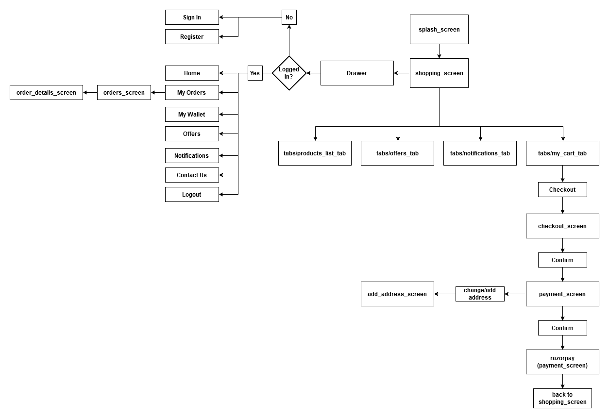

# Dailygurus
This app was built using Flutter Version 1.17.5 & Dart 2.8.4.

# Overview

The flowchart above represents a basic structure of the app. 

# Screens
## Splash Screen
The splash screen simply displays the DailyGurus logo and navigates to the *shopping_screen* after a delay of **2 seconds**.

## Shopping Screen
The *shopping_screen* has four tabs and the user can navigate between the tabs using the BottomNavigationBar. The user can add products to his cart from the *products_list_tab* and view his cart from the *my_cart_tab*. After viewing the cart, the user can proceed to checkout which directs him further in the payment flow.
The *shopping_screen* also has an app drawer which displays options according to the user's login state.

###### initState
The **initState** function of the *shopping_screen* calls two functions -
- **getUserData()** - This function checks if the user has already logged in and the data is available via SharedPreferences. If the data is available, the state is updated accordingly.
- **getCartInfo()** - This function calls the *fetchCartInfo* function of the **ShoppingProvider** which fetches the user's cart from the backend and updates the cartTotal and the cartItems.

#### Drawer
The shopping screen also has an app drawer which displays ListTiles based on the *loginState* of the user.

If the user is logged in the following ListTiles are displayed -
- *Home* - Navigates the user to the *products_list_tab*.
- *My Orders* - Navigates the user to the **orders_screen**.
- *My Wallet*
- *Offers* - Navigates the user to the *offers_tab*.
- *Notifications* - Navigates the user to the *notifications_tab*.
- *Contact Us*
- *Logout* - Clicking the logout tile calls the **logout** function.

If the user is not logged in the following ListTiles are displayed -
- Sign In - Navigates the user to the **login_screen**.
- Register - Navigates the user to the **register_screen**.

#### Tabs
The shopping screen has a bottom navigation bar which the user can use to switch between tabs. There are 4 tabs that the user can switch between -
- *products_list_tab*
- *offers_tab*
- *notifications_tab*
- *my_cart_tab*

##### products_list_tab

The **products_list_tab** is the default tab for the Shopping Screen. This tab displays a horizontal ListView of **CategoryCard** and a vertical ListView of **ProductCard**. The user can increment or decrement the product quantity which calls the *incrementProduct* and *decrementProduct* functions of the **ShoppingProvider**.

###### initState
When the tab is initialized, the *fetchData* function is called which calls the *fetchCategories* and *fetchProducts* functions of the ProductsProvider to get the categories and products data. This method also checks if any category is selected and filters the products accordingly.

###### handleCategoryChange
The *handleCategoryChange* function loads a fresh list of products from the backend and then filters the products based on the selected category.

##### offers_tab
Blank for now

##### notifications_tab
Blank for now

##### my_cart_tab
The *my_cart_tab* displays a vertical ListView of **CartProductCard** if the user has added products to his cart. If the cart is empty, the empty cart message is displayed. The user can increment or decrement the product quantity which calls the *incrementProduct* and *decrementProduct* functions of the **ShoppingProvider**. The user can also remove an item from his cart which calls the *removeProduct* function of the **ShoppingProvider**.
The *my_cart_tab* also contains a checkout button which displays the Cart Total for the current cart. If the user clicks this button, his login state is checked and if the user has logged in, he is routed to the **checkout_screen** else the user is routed to the **login_screen**.

## Checkout Screen

The checkout screen displays a summary of the user's order by displaying all the products in cart in a vertical ListView of **CheckoutItem** card followed by a **Cart Total**. If the user clicks the confirm button, the **addToCart** function of the **ShoppingProvider** is called. This function updates the backend to indicate what products the user has selected. Finally, if the result of the **addToCart** function has a *SUCCESS* status, the user is routed to the **payment_screen**.

## Payment Screen

The payment screen displays the selected delivery address or if the address is not selected the user is asked to select an address. The user has options to select the payment method using radio button and he can finally press the confirm button to process the order.

###### initState
calls the *fetchAddressData* function.

###### fetchAddressData
Checks if the user has selected an address previously and updates the state by loading the address details using Shared Preferences.

###### _handlePaymentRadioButtons
The *handleOnChanged* method for the payment option radio buttons. This function updates the payment option in the state and if the user clicks on the 'Pay from Wallet' option, the *getWalletDetails* function is called which checks if the user has a sufficient balance in his wallet to process the payment.

###### getWalletDetails
Calls the *fetchWalletInfo* method of the **ShoppingProvider** which returns the available wallet balance. If the user's balance is more than the *cartTotal* the payment option is updated, otherwise a snackbar is displayed and the previously selected payment option is selected.

###### initOrder
This method gets called when the user clicks on the *Confirm* button to make the payment. A 'Processing your Order' dialog is shown and the selected payment option and selected address are checked for null. If the selected payment option and the selected address is *not null*, an *OrderDetails* object is created using the order data and it is passed to the **initOrder** method of the **ShoppingProvider**. After getting the result of the **initOrder** function, if the *payment_mode* is 'Pay on Delivery' or 'Pay from Wallet', a success dialog is displayed. If the *payment_mode* is 'Debit Card/ Credit Card/ NetBanking' the **startRazorPayPayment** function is called.

###### startRazorPayPayment
This method receives the email, phone number and the grand total of the order which it passes to the RazorPay plugin. The RazorPay plugin has 3 callbacks - _handlePaymentSuccess, _handlePaymentError and _handleExternalWallet.

###### _handlePaymentSuccess
This method is called if the RazorPay transaction is successful, it receives the PaymentSuccessResponse from the RazorPay plugin and passes the orderID, paymentID and the userID to the **paymentResponse** function of the **ShoppingProvider**. If the **paymentResponse** function call is successful, a success dialog is displayed.

###### _handlePaymentError
This method is called if the RazorPay transaction is cancelled or there was an error. It displays an error snackbar.

###### _onWillPop
Displays an AlertDialog if the user tries to return to the previous page.

## Add Address Screen
The user can use this screen to select the current address or add/edit saved addresses.

###### fetchAddresses
Calls the **fetchAddresses** method of the **ShoppingProvider** and updates the state with the returned list of addresses.

###### addAddress
Calls the **addAddress** method of the **ShoppingProvider** and updates the addresses in state by calling the *fetchAddresses* function.

###### editAddress
Calls the **editAddress** method of the **ShoppingProvider** and if the address is successfully updated, calls the *fetchAddresses* method to update the state.

###### addCurrentAddress
This method is called when the user clicks the 'set as Current Address' button for a particular address. A confirmation AlertDialog is shown and if the user selects 'yes' the address data is stored in Shared Preferences.

## Login Screen
The Login Screen receives the AuthArguments object which has a **rootRoute** property. This **rootRoute** is the route from which the Login Screen was opened. The login screen has one main function - *login*. This function is called after the user clicks the login button. The following steps are followed for the login process.
1. The email and password are passed to the **login** function of the **AuthProvider**. This returns the HTTPResult which contains the status flag as well as the data received from the backend.
2. If the login status flag is set as **SUCCESS** and the *OTP_STATUS* of the user is **NOT_VERIFIED** - The **resendOTP** method of the **AuthProvider** is called which sends another OTP to the user.
 1. If the status of the **resendOTP** function is *SUCCESS* then the user is shown a message asking him to verify the OTP and then the user is routed to the OTPVerificationScreen.
 2. If the status of the **resendOTP** function is *ERROR* then an error message is displayed.
3. If the status flag is set as **SUCCESS** and the *OTP_STATUS* of the user is **VERIFIED** - The user is shown a 'Login Successful' message and is routed to the **rootRoute** from the AuthArguments.
4. If the status flag is set as **ERROR** - an error message is shown to the user.

## Register Screen
The register screen receives the AuthArguments object which has a **rootRoute** property. This **rootRoute** is the route from which the Register Screen was opened. The register screen has one main function - *register*.  This function is called after the user clicks the login button. The following steps are followed for the registration process.
1. The name, email, password and phone are passed to the **register** function of the **AuthProvider**. This returns the HTTPResult which contains the status flag as well as the data received from the backend.
2. If the status flag is set as **SUCCESS** then the user is routed to the OTPVerificationScreen. An OTPArguments object is also passed to the route which contains the *otp_register_id* and the *rootRoute*.
3. If the status flag is set as **ERROR** then an error message is shown.

## OTP Verification Screen
The OTP Verification Screen receives the OTPArguments object which has a **rootRoute** and a **userID** property. The **rootRoute** refers to the page from which the Register or Login Screen before the current screen was called. After the OTP is verified, the user is routed to the **rootRoute**. The following steps are followed for the OTP Verification Process -
1. The userID and the otpValue are passed to the **verifyOTP** function of the **AuthProvider**. This returns the HTTPResult which has a status flag as well as the data received from the backend.
2. If the status flag is set as **ERROR**, an error message is displayed.
3. If the status flag is set as **SUCCESS**, the email and password of the user are loaded from Shared Preferences. These are then passed to the **login** function of the **AuthProvider**. This function returns the HTTPResult which contains the status flag and the user's details.
 1. If the loginResult status flag is set as **SUCCESS** and the *OTP_STATUS* is **VERIFIED**, a 'Login Successful' message is displayed and the user is routed to the *rootRoute*.
 2. Else the relevant error message is displayed.

## Orders Screen
The orders screen displays a list of the user's previous orders in a vertical ListView of *OrderCard*. The OrderCard also displays timelines which show the stages of the order.

###### getOrders
The getOrders function calls the **getUserOrders** function of the **OrdersProvider**, after the function call has completed, the orders are loaded from the **OrdersProvider** and the state is updated.

## Order Details Screen
The Order Details Screen displays the details of an order order that the user selects. The Order Details Screen receives the **OrderRouteArguments** object which contains the *ID* and the *index* of the selected order. The order details are then loaded from the **OrdersProvider** and the state is updated.

###### getItems
This calls the **getOrderDetails** function of the **OrdersProvider**. This function gets the list of orderItems which are associated with the selected order. If the function call is successful, the state is updated.